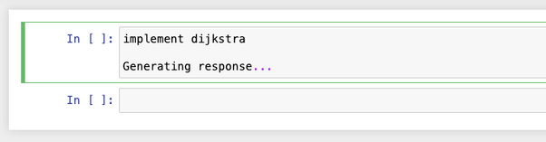
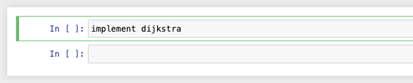
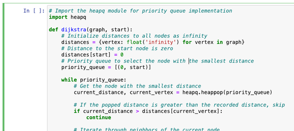

# Jupyter Autofill Chrome Extension

First, you write in human language what you want to do

Then, you hit command+K to initialize generation

A thinking model (like OpenAI o4-mini) is called to prefil the cell

You will need your OpenAI API key for this.

This does not work with JupyterLab, and this only works with the classic Jupyter notebook.

You will need to run `pip install nbclassic` and then `jupyter nbclassic`

# Installation guide

- Visit chrome://extensions/
- Enable Developer mode (top right)
- Load extension - select this folder
- Run Cmd-K on a notebook cell
    - You will be redirected to a setings page
    - Submit your API key and a preferred default model
- Run Cmd-K on a notebook cell again

# Improvement ideas

- Allow other base urls
- Allow customization of the system prompt

Generally I am bottlenecked by Chrome extension iteration cycle.
It seems that I need to manually click like 8 buttons in some correct order to test every change.
